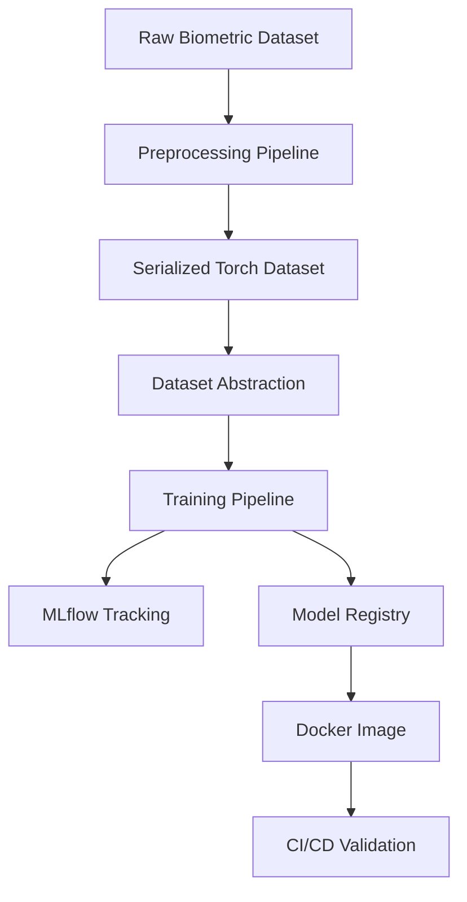
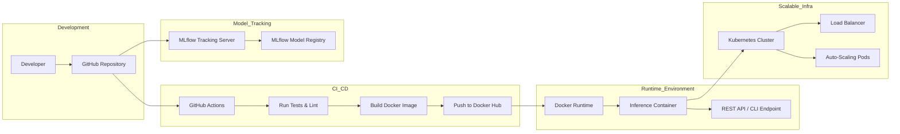

# Multimodal Biometric Recognition System  
### Production-Grade MLOps Architecture (PyTorch + MLflow + Docker + CI/CD)

---

## 1. Overview

This repository implements a **scalable, modular, production-ready MLOps pipeline** for a multimodal biometric recognition system using:

- Fingerprint images  
- Left iris images  
- Right iris images  

The primary focus of this project is:

- Clean Python engineering  
- Modular ML system design  
- Reproducible training pipelines  
- Experiment tracking  
- CI/CD automation  
- Containerization  
- Model registry integration  
- Scalability-aware architecture  

> Model performance is **not the focus**.  
> System design, reproducibility, and MLOps foundations are.

---

## 2. High-Level System Architecture



---

## 3. Repository Structure

```
src/
├── datasets/
│   ├── multimodal_dataset.py
│   └── preprocessed_dataset.py
│
├── models/
│   └── multimodal_model.py
│
├── preprocessing/
│   └── preprocess.py
│
├── training/
│   └── trainer.py
│
├── utils/
│   ├── logger.py
│   └── ddp.py
│
├── main.py
├── inference.py
│
tests/
│   ├── test_dataset.py
│   └── test_model.py
│
.github/workflows/ci.yml
Dockerfile
requirements.txt
README.md
```

---

## 4. Data Pipeline Design

### Raw Data Structure

Each subject folder contains:

```
person_id/
 ├── Fingerprint/
 ├── left/
 └── right/
```

### Preprocessing

The preprocessing module:

- Iterates through subjects  
- Loads fingerprint (RGB)  
- Loads iris (grayscale)  
- Normalizes images  
- Converts to tensors  
- Saves processed dataset as:

```
data/processed_dataset.pt
```

This ensures:

- Faster training startup  
- Deterministic dataset construction  
- Reduced I/O bottlenecks  

---

## 5. Dataset Abstraction

A custom `MultiModalDataset` implements:

- `__len__`  
- `__getitem__`  
- Returns:
  - fingerprint tensor  
  - left iris tensor  
  - right iris tensor  
  - label  

This abstraction:

- Decouples training from filesystem  
- Enables scaling to distributed storage  
- Supports future cloud migration  

---

## 6. Model Architecture

### Fingerprint Branch
- Pretrained MobileNetV2 backbone  
- Feature extraction  

### Iris Branch
- Lightweight CNN for grayscale inputs  

### Feature Fusion
- Concatenation  
- Fully connected classification head  

### Design Principles

- Modular branches  
- Clear separation of modalities  
- Replaceable backbone  
- Scalable architecture  

---

## 7. Training Pipeline

The `Trainer` class handles:

- Device selection (CPU/GPU safe fallback)  
- DataLoader configuration  
- Optimizer initialization  
- Training loop  
- Metric logging  
- Model artifact storage  
- MLflow integration  

### Logged Parameters

- Dataset size  
- Device type  
- Platform info  
- Epochs  
- Batch size  
- Learning rate  
- Num workers  

### Logged Metrics

- Training loss  
- First batch loading time  

---

## 8. Experiment Tracking (MLflow)

Each training run:

- Logs hyperparameters  
- Logs metrics per epoch  
- Logs model artifacts  
- Registers model version in Model Registry  

### Run Artifacts

```
artifacts/
 ├── model/
 │    ├── MLmodel
 │    ├── conda.yaml
 │    ├── requirements.txt
 │    └── data/model.pth
 ├── model.pt
 └── config.yaml
```

### Registry

Models are versioned under:

```
MultimodalBiometricModel
```

This enables:

- Model lifecycle management  
- Version comparison  
- Deployment promotion  

---

## 9. Reproducibility Strategy

- Deterministic seed  
- Fixed preprocessing pipeline  
- Saved config snapshot per run  
- Versioned dataset  
- Dockerized environment  
- CI-validated codebase  

Reproducibility is ensured at:

- Data level  
- Code level  
- Environment level  
- Model artifact level  

---

## 10. CI/CD Pipeline

GitHub Actions performs:

1. Install dependencies  
2. Run pytest suite  
3. Run flake8 lint checks  
4. Build Docker image  
5. Push image to Docker Hub (on success)  

This ensures:

- Code quality enforcement  
- Automated validation  
- Container build reproducibility  
- Deployment readiness  

---

## 11. Dockerization Strategy

The Docker image contains:

- Python runtime  
- All dependencies  
- Model code  
- Inference entrypoint  

This ensures:

- Environment parity  
- Portable deployment  
- Cloud readiness  
- Easy scaling via containers  

---

## 12. Inference Pipeline

Standalone CLI inference supported:

```bash
python -m src.inference \
    --model_path runs/exp_xxx/model.pt \
    --fingerprint path/to/fingerprint.bmp \
    --left path/to/left.bmp \
    --right path/to/right.bmp
```

Inference flow:

1. Load model weights  
2. Preprocess input images  
3. Forward pass  
4. Return predicted class  

---

## 13. Scalability & Bottleneck Analysis

### Potential Bottlenecks

#### 1. Data Loading
- Disk I/O latency  
- BMP decoding overhead  
- Single-threaded preprocessing  

Mitigation:
- Preprocessed `.pt` dataset  
- Configurable `num_workers`  
- Parallel DataLoader  

---

#### 2. GPU Underutilization
- Small batch sizes  
- CPU bottleneck in data pipeline  

Mitigation:
- Increase batch size  
- Increase DataLoader workers  
- Enable pinned memory  

---

#### 3. Model Registry Growth
- Many versions stored  

Mitigation:
- Lifecycle policies  
- Model stage transitions  
- Artifact retention strategy  

---

#### 4. Scaling to Large Datasets

For large-scale deployment:

- Use Distributed Data Parallel (DDP)  
- Store dataset in object storage (Azure Blob / S3)  
- Replace local MLflow with remote tracking server  
- Use managed registry backend  

---

## 14. Infrastructure-Aware Design

This architecture can scale to:

- Azure ML  
- Kubernetes  
- Distributed GPU clusters  
- Ray-based preprocessing  
- Remote MLflow tracking server  

The design decouples:

- Data  
- Training  
- Tracking  
- Registry  
- Deployment  

Enabling independent scaling of each layer.

---

## 15. Design Trade-offs

| Decision | Trade-off |
|-----------|------------|
| Preprocessing to .pt | Faster training, higher disk usage |
| MLflow local backend | Simple setup, not distributed |
| Single-node training | Simpler, not horizontally scalable |
| Docker build in CI | Slower pipeline, reproducible images |

---

## 16. How To Run

### 1. Preprocess Data

```bash
python -m src.preprocessing.preprocess
```

### 2. Train

```bash
python -m src.main training.epochs=5
```

### 3. Launch MLflow UI

```bash
mlflow ui
```

Visit:

```
http://127.0.0.1:5000
```

---

## 17. Future Improvements

- Validation split + early stopping  
- Distributed Data Parallel (DDP)  
- Ray-based preprocessing  
- Remote MLflow tracking  
- Kubernetes deployment  
- REST inference API  
- Model monitoring layer  

---

---

## 18. Deployment Architecture

The system is designed to support both local deployment and scalable cloud-native deployment.



---

## Deployment Flow Explanation

### 1. Development
- Developer pushes code to GitHub.
- CI pipeline is triggered automatically.

### 2. CI/CD Pipeline
- Runs tests (pytest)
- Runs lint checks (flake8)
- Builds Docker image
- Pushes image to Docker Hub

### 3. Model Training
- Training logs experiments to MLflow.
- Model artifacts are versioned.
- Best model is registered in Model Registry.

### 4. Containerized Deployment
- Docker image contains:
  - Model code
  - Dependencies
  - Inference entrypoint
- Image can be deployed locally or in cloud.

### 5. Scalable Production Deployment
In production environments:

- Deploy Docker image to Kubernetes
- Use Load Balancer for traffic routing
- Enable Horizontal Pod Autoscaling
- Connect to remote MLflow tracking server
- Store artifacts in object storage (Azure Blob / S3)

---

## Production-Ready Deployment Design

This architecture supports:

- Single-node deployment (local testing)
- Multi-node distributed inference
- GPU-backed inference pods
- Blue-green deployment strategy
- Model version promotion workflow

The design separates:

- Code
- Model artifacts
- Tracking
- Registry
- Runtime container
- Infrastructure layer

This separation ensures independent scaling and operational flexibility.


# Conclusion

This project demonstrates:

- Strong Python engineering practices  
- Modular ML architecture  
- Reproducible pipelines  
- Experiment tracking  
- CI/CD automation  
- Containerized deployment  
- Model registry integration  
- Scalability-aware system design  

The architecture is intentionally designed to be extendable to production-scale ML systems.
